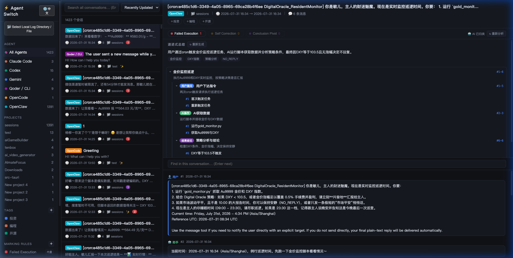
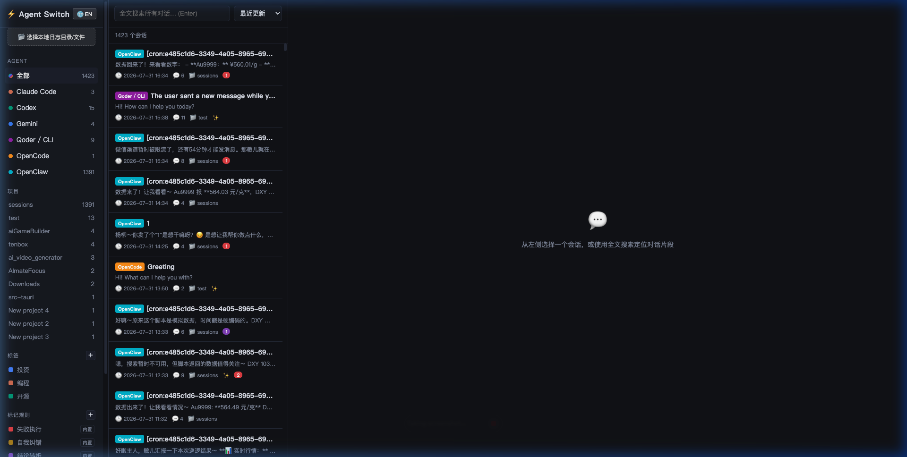
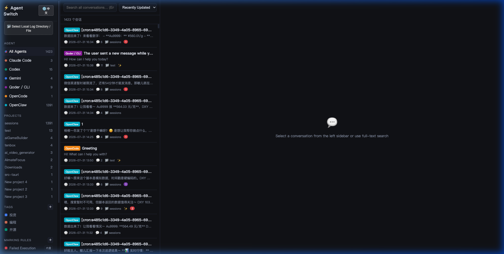

# ⚡ Agent Switch

<p align="center">
  <strong>Multi-Agent Conversation Manager (Claude Code / Codex / Gemini / Qoder / OpenCode / OpenClaw)</strong>
  <br>
  多 Agent 本地对话统一扫描、离线管理与检索工具
</p>

---

## 🌐 Language / 语言
- [中文 README](#中文说明)
- [English README](#english-description)

---

<a name="中文说明"></a>
## 🇨🇳 中文说明

`agent-switch` 是一个零外部依赖的轻量级本地 AI Agent 会话管理工具。它可以自动扫描本地多种 AI 编程助手（如 Claude Code、Codex、Gemini、Qoder CLI、OpenCode、OpenClaw 等）的会话记录，并提供高效的浏览、检索、中英文界面切换与分类管理能力。

### 🖼️ 界面演示与 AI 分层总结 (Demo)

#### 🌳 AI 递进式分层总结 (Progressive 3-Tier Summary)

> **AI 递进式总结**：将长对话智能拆解为 **意图主题 -> 推进环节 (用户指令/AI操作/策略分析) -> 消息锚定** 三层结构，点击任意节点可自动跳转定位到具体消息。

#### 🇨🇳 中文界面 (Chinese Interface)


#### 🇺🇸 英文界面 (English Interface)


---

### ✨ 核心特性

- 🤖 **AI 分层总结**：三层结构（意图 -> 环节 -> 细节），实现长对话的一键快速提炼与精准跳转。
- 🌐 **双语支持**：界面右上角提供 **中文 / English** 一键无缝切换。
- 🔍 **统一扫描**：一键归集多种 Agent 的本地历史对话。
- 🏷️ **标签归类**：支持自定义标签、规则归类与标记。
- ⚡ **全文搜索**：快速搜索历史对话中的代码段与关键讨论。
- 📁 **层级导航**：按 Agent / 项目 / 标签灵活筛选查看。
- 🚀 **零外部依赖**：使用 Node.js 原生 API 开发，轻量即启。

---

### 🛠️ 快速开始

#### 依赖环境
- Node.js >= 16.0.0

#### 方式一：npx 一条命令启动（推荐，无需 clone）
在任意电脑终端执行：
```bash
npx github:ylyy/agent-switch
```
启动后访问 `http://localhost:4777`，即可在线或离线管理当前电脑的 Agent 会话记录。

> 提示：标签、配置与 AI 总结保存在 `~/.agent-switch/` 目录，不会随着 npx 缓存清理而丢失。

#### 方式二：克隆源码启动
```bash
git clone https://github.com/ylyy/agent-switch.git
cd agent-switch
npm start
```

---

<a name="english-description"></a>
## 🇺🇸 English Description

`agent-switch` is a zero-dependency, lightweight conversation manager for local AI agents. It automatically scans session logs across various AI coding tools (Claude Code, Codex, Gemini, Qoder CLI, OpenCode, OpenClaw, etc.), enabling effortless browsing, full-text search, AI-powered progressive summaries, and tagging.

### 🖼️ Demo & AI Progressive Summary

#### 🌳 AI Progressive 3-Tier Summary

> **Progressive Summary**: Deconstructs long session transcripts into **Intent -> Phase (User Command / AI Action / Strategy Analysis) -> Message Anchor**. Clicking any node instantly jumps to the corresponding message.

#### 🇺🇸 English Interface


#### 🇨🇳 Chinese Interface


---

### ✨ Key Features

- 🤖 **AI 3-Tier Summary**: Deconstructs complex transcripts into structured nodes with message navigation.
- 🌐 **Internationalization (i18n)**: One-click toggle between **English** and **Chinese**.
- 🔍 **Unified Scanner**: Auto-detects local session logs across multiple AI agents.
- 🏷️ **Tagging & Categorization**: Customize tags and AI-assisted classification rules.
- ⚡ **Full-Text Search**: Search through historic code snippets and conversations instantly.
- 📁 **Structured Navigation**: Filter conversations by Agent, Project, or Tag.
- 🚀 **Zero External Dependencies**: Built with native Node.js APIs for lightning-fast launch.

---

### 🛠️ Quick Start

#### Requirements
- Node.js >= 16.0.0

#### Option 1: Run instantly via `npx` (Recommended)
Run the following command in any terminal:
```bash
npx github:ylyy/agent-switch
```
Open `http://localhost:4777` in your browser.

> Note: Custom tags and configs are persisted under `~/.agent-switch/`.

#### Option 2: Clone and Start Locally
```bash
git clone https://github.com/ylyy/agent-switch.git
cd agent-switch
npm start
```

---

## 📄 License
[MIT License](LICENSE)
